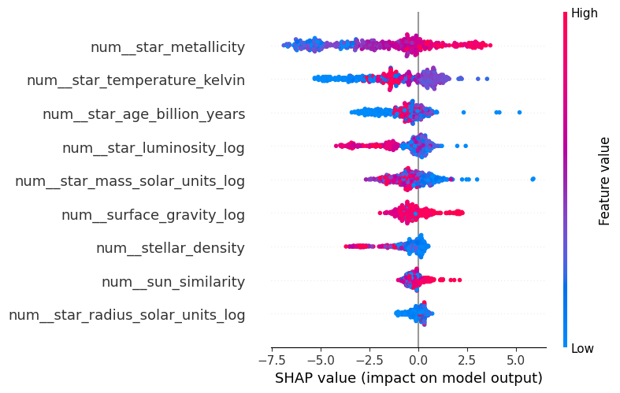
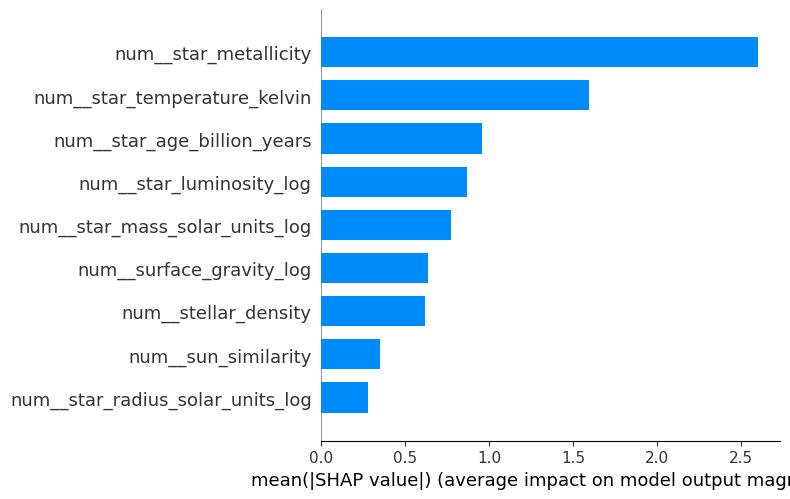

# Exoplanet Host Star Prediction

## Project Overview

This project uses machine learning to identify stars that share characteristics with known exoplanet-host stars.

The model was trained using stellar data from:

* NASA Exoplanet Archive (confirmed exoplanet host stars)
* Gaia DR3 (comparison stars)

The goal is not to confirm the presence of exoplanets, but to estimate how similar a star is to known exoplanet-host systems based on its physical properties.

---

## Features

The final model uses:

* Stellar Metallicity
* Stellar Temperature
* Stellar Mass
* Stellar Radius
* Surface Gravity
* Stellar Luminosity
* Stellar Age
* Stellar Density
* Sun Similarity Score

Additional engineered features:

* Log-transformed stellar mass
* Log-transformed stellar radius
* Stellar density
* Sun similarity metric

---

## Data Sources

### NASA Exoplanet Archive

Confirmed exoplanet host stars:

https://exoplanetarchive.ipac.caltech.edu/

### Gaia DR3

Stellar parameters used for:

* Host star enrichment
* Negative sample generation
* Candidate star inference


## Gaia Archive Access

This project uses data from Gaia DR3 through the `astroquery.gaia` package.

Some data collection notebooks require a Gaia Archive account to execute large queries.

Before running the data collection pipeline:

1. Create a free Gaia Archive account:

   https://gea.esac.esa.int/archive/

2. Login within the notebook:

```python
from astroquery.gaia import Gaia

Gaia.login(user="YOUR_USERNAME",password="YOUR_PASSWORD")
```


---

## Project Workflow

1. Download confirmed exoplanet-host stars from NASA.
2. Match host stars with Gaia DR3.
3. Collect comparison stars from Gaia DR3.
4. Clean and standardize stellar parameters.
5. Engineer additional astrophysical features.
6. Train multiple machine learning models.
7. Evaluate performance using cross-validation.
8. Interpret predictions using SHAP.
9. Deploy the final model through a FastAPI service.

---

## Models Evaluated

| Model               | ROC-AUC | F1 Score |
| ------------------- | ------- | -------- |
| Logistic Regression | 0.93    | 0.71     |
| Random Forest       | 0.98    | 0.81     |
| XGBoost             | 0.99    | 0.91     |

The final model selected was **XGBoost**.

---

## Final Model Performance

### Metrics

* ROC-AUC: 0.9913
* F1 Score: 0.9121
* Recall: 0.8991
* Precision: 0.9254

### Feature Importance

Top predictive features:

1. Stellar Metallicity
2. Stellar Luminosity
3. Stellar Temperature
4. Stellar Mass

---

## Model Explainability

SHAP was used to explain model predictions and validate feature importance.

### SHAP Summary Plot



### Feature Importance



---
## Deployment

The final model was deployed as a FastAPI application and containerized using Docker to ensure consistent execution across different environments.

### FastAPI

The API accepts stellar parameters and returns a host-likeness score based on the trained XGBoost model.

#### Start the API

```bash
uvicorn api.main:app --reload
```

#### Swagger Documentation

```text
http://127.0.0.1:8000/docs
```

### Docker

The application is fully containerized and can be run without manually installing project dependencies.

#### Build Docker Image

```bash
docker build -t exoplanet-api .
```

#### Run Container

```bash
docker run -p 8000:8000 exoplanet-api
```

#### Access API

```text
http://localhost:8000/docs
```

### API Example

Request:

```json
{
  "star_metallicity": 0.0,
  "star_mass_solar_units": 1.0,
  "star_age_billion_years": 4.6,
  "surface_gravity_log": 4.44,
  "star_radius_solar_units": 1.0,
  "star_temperature_kelvin": 5778,
  "star_luminosity_log": 0.0
}
```

Response:

```json
{
  "host_likeness_score": 0.99,
  "label": "Very host-like"
}
```

# Author

Semyon Sidorov


---

## Project Structure

```text
EXOPLANETS_PROJECT/
│
├── api/
│   └── main.py
│
├── data/
│   ├── raw/
│   └── processed/
│
├── model/
│   ├── xgboost_exoplanet_model.pkl
│   └── metrics.json
│
├── notebooks/
│   ├── fetching_data.ipynb
│   ├── batching_data.ipynb
│   └── EDA.ipynb
│
├── src/
│   ├── fetch_data.py
│   └── exoplanet_features.py
│
├── Dockerfile
├── .gitignore
├── requirements.txt
└── README.md

```

---

## Important Note

The model predicts **host-likeness**, not the actual existence of exoplanets.

A high score indicates that a star shares characteristics with known exoplanet-host stars in the training data. It should not be interpreted as evidence that a star definitely hosts planets.

---

## Technologies

* Python
* Pandas
* NumPy
* Scikit-learn
* XGBoost
* SHAP
* FastAPI
* Docker
* Jupyter Notebook
* Gaia DR3
* NASA Exoplanet Archive

```
```
